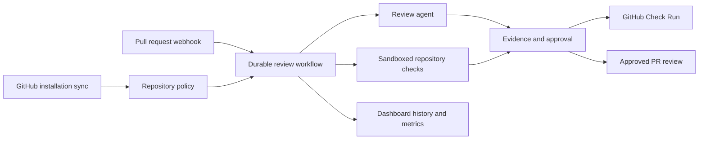
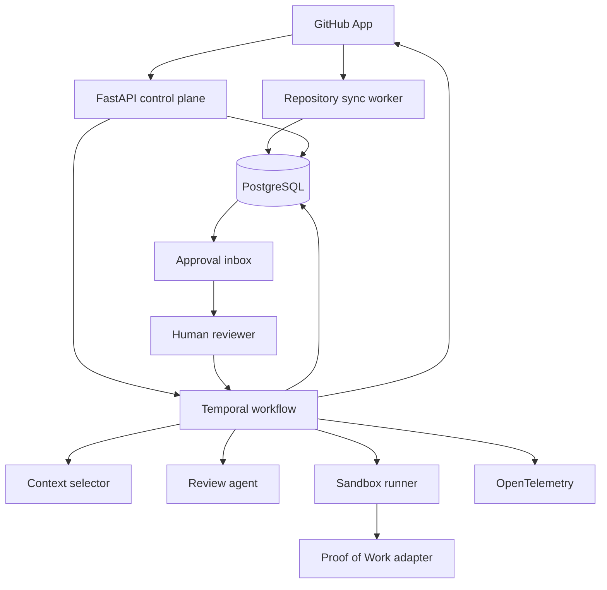

# Architecture

## Goal

Review a GitHub pull request with one agent, verify the result, and require human approval
before any output is published.

The product is an AI pull request reviewer. Selected CI-style checks may provide evidence, but
the platform does not own deployments or general CI/CD pipelines.

## Current implementation and production target



The diagram includes the production target. Provider operations (#36), installation inventory
and policy (#37), repository-defined checks (#41), and GitHub sessions (#44) are implemented.
Check Runs (#40), complete history/analytics (#38/#39), and release artifacts (#45) remain
planned. See [authentication](authentication.md).

Installation state, repository policy, and repository audit records are persisted now. Planned
records include Check Runs, retained artifacts, runner heartbeats,
and complete metric facts. See [production readiness](production-readiness.md).

## Main components



## Ownership

- FastAPI owns authentication, webhook intake, API validation, and product records.
- Repository sync owns periodic GitHub inventory reconciliation; the API and dispatcher enforce policy.
- Temporal owns run order, retries, cancellation, timeouts, and approval waits.
- Context selector owns file selection under a fixed token budget.
- Review agent owns structured proposed findings. It cannot publish them.
- Sandbox runner owns untrusted test execution.
- Proof of Work adapter owns the stable verification boundary.
- Web application owns review and approval screens.
- PostgreSQL owns product state and append-only audit events.

## Run boundary

A run is identified by owner, PR, head SHA, and increasing generation. A new head creates a new
run; reopening can create a new generation for the same SHA. Supersession cancels an older active
run after any already-started approved publish settles. Findings never move between commits.

GitHub webhook intake verifies the HMAC SHA-256 signature over raw bytes before decoding JSON.
Supported PR actions are opened, reopened, synchronize, and closed. Installation and repository
lifecycle events are also accepted. PR delivery IDs are inserted in the same transaction as
PR state and any admitted run/command records. Repositories must already exist in synchronized inventory. A repeated owner and delivery ID returns success without creating another command.
The configured GitHub App installation is bound to one owner; validly signed events from other
installations are rejected before any database write. Command events store the complete versioned
`StartRunCommand`, never raw webhook payloads.
GitHub's pull request `updated_at` timestamp prevents older deliveries from regressing current
head or state. Reopening a pull request creates a new run generation even when its head SHA did
not change.
When opposite state events have the same source timestamp, open wins. This conservative rule can
cause an extra review but cannot let an ambiguous delayed close suppress a review.
Equal-time synchronize events use GitHub's required `before` and `after` SHA chain, including
out-of-order delivery, so a delayed predecessor cannot replace its known descendant.

## Installation and admission boundary

The sync worker reads the configured installation at startup and every 60 seconds using an
installation-wide metadata-only token. Complete bounded snapshots use a revision check under
an installation advisory lock; a concurrent lifecycle delivery or newer sync invalidates stale
results. Removal/suspension revokes immediately. Added/restored webhooks never grant access by
themselves. Reconciliation preserves repository pauses and budgets, and records per-repository
identity/metadata changes in append-only `repository_events`.

Intake and queued dispatch both require active access, an enabled repository, an allowed exact
base branch, and installation sync within 15 minutes. Run creation snapshots token/cost budgets,
base branch, and the `default` verification profile. A budget reduction can block an older queued
command. Policy changes do not cancel running reviews. Blocked deliveries are recorded without
deferred execution; a new PR event is required after recovery. Closed events still update known
PR state while reviews are paused. See [repository policy](repository-policy.md).

## Message boundary

Messages use strict versioned JSON. A contract includes:

- `schema_version`
- `public_id`
- `owner_id`
- `run_id`
- `head_sha`
- event-specific payload

Unknown fields are rejected in version one. New optional fields require a minor contract
version. Breaking changes require a new major version and explicit migration.

Version-one contracts are defined in `packages/contracts/`. All contracts are immutable and
reject unknown fields. Run-bound messages carry `schema_version`, `public_id`, `owner_id`,
`run_id`, and `head_sha`. Webhook envelopes carry delivery, installation, repository, and pull
request identity before a run exists.

The run state machine is:

```text
queued -> selecting_context -> analyzing -> verifying -> awaiting_approval
                                                             |        |
                                                             v        v
                                                         published  rejected
```

Active states may also end as `failed` or `cancelled`. Terminal states cannot restart.

## Durable workflow boundary

One Temporal workflow ID is stable for an owner and pull request. Intake uses Temporal's atomic
signal-with-start operation: the first command starts the workflow, while a command for a new
head SHA signals the active execution. The old run records an explicit cancelled outcome and
continues as new with the replacement run, so two heads are never active in one workflow.
Webhook intake commits each command to the PostgreSQL outbox before returning. A production
dispatcher locks one pending command, sends its stable request ID to Temporal, then appends a
dispatch receipt. Before retrying, it rejects mismatched command identities and receipts commands
whose database generation is superseded or whose run is terminal. A superseded command that never
left the queue is cancelled with a terminal audit event in the same transaction. Active-run
retries use the same Temporal request, workflow generation, activity IDs, and provider idempotency
keys.
Database run generation travels in every start command. The workflow keeps only the highest
pending generation, so delayed signals cannot replace a newer commit or reopen generation.
Generation increases across every run for a pull request, including both new heads and reopens.
If an approved publish has already started, it settles before supersession; the old run records
the truthful publish outcome, then the replacement continues as new.

Context selection, analysis, verification, terminal recording, and publish are activities with
bounded timeouts, three retry attempts, stable activity IDs, and deterministic idempotency keys.
The production workflow worker polls workflow tasks from the configured queue. One provider
activity-worker deployment must register the complete activity set on that queue through the
`ActivityOperations` factory contract. The provider image may deploy or scale independently, but
partial activity sets must not compete on one queue. Missing activity workers fail within the
bounded schedule-to-start timeout instead of waiting forever.
Activity implementations must use those keys for database or provider writes. Human approval has
its own timeout. Human cancellation, rejection, timeout, and supersession are separate outcomes.
Activities heartbeat while running; cancellation waits for the current operation to stop before
recording a terminal outcome. Identity-valid early approvals wait until verification completes.
Temporal history stores identities and safe output references, not repository source, prompts,
model output, comment bodies, or secrets.

Webhook requests, outbox dispatch, workflows, and activities share one W3C trace. Only the bounded
`traceparent` identity crosses the PostgreSQL outbox in `StartRunCommand` schema version `1.1`;
workers still accept legacy version `1` commands without that optional field. Temporal propagates
it to model and tool
activity attempts. Run and activity histograms, retry counts, approval-wait spans, and explicit
known/unknown provider usage are exported through OTLP. Production readiness checks PostgreSQL,
Temporal, and owner-bound installation sync freshness independently.

## Context boundary

Context selection is deterministic. Changed files are ordered first, followed by their direct
local Python imports. Repository paths are normalized and unsafe paths are rejected. Configured
generated or dependency directories are excluded. When the budget cannot hold a complete file,
the selector records a truncated prefix; remaining eligible files are recorded as excluded.
The selector accepts the model adapter's token counter so the final rendered context stays within
the configured model budget.

## Review-agent boundary

The review agent depends only on a provider-neutral `ModelClient`. It sends context and a strict
JSON schema, rejects invalid or duplicate structured findings, then attaches trusted run identity.
Provider failures return no partial result. Provider-reported duration, token usage, coverage, and
exact cost cross the boundary without estimating unknown values. The production activity package
uses the OpenAI Responses API with strict structured output and disables response storage. It
records provider token counts exactly and leaves cost unknown because the response does not report
billed cost. GitHub App tokens are short-lived and scoped to the exact repository.

## Persistence boundary

PostgreSQL stores summaries and safe evidence references. It does not store repository source,
secrets, raw prompts, full agent output, or sandbox contents. Temporal history stores safe
workflow arguments only.

Five migrations define current storage. Core entities expose ULIDs; internal joins use bigint
keys and composite owner constraints. `github_installations` uses `(owner_id, installation_id)`
as its key, while internal `repository_events` use an identity key and owner-scoped event keys.
PR run uniqueness includes head SHA and generation. Repository rows persist installation/access
state, default branch, enabled state, branch policy, budgets, verification profile, and timestamps.
Finding keys, approvals, external action targets, and event keys are unique at their retry boundary.
Both audit tables reject updates, deletes, and truncation. Schema tables are defined in
[migrations](../migrations); do not infer unimplemented history fields from the target diagram.

Migrations run in filename order under a PostgreSQL advisory lock. Applied checksums are stored
in `schema_migrations`; changing an applied migration stops startup instead of silently changing
database history.

## Sandbox boundary

Pull request commands run only through `SandboxVerificationOperation` and the Docker sandbox
runner. Its trusted prepare and record callbacks may resolve inputs and persist bounded evidence;
they must never execute pull request commands. The worker copies the reviewed checkout into a
temporary source directory without `.git`, with byte, entry-count, and staging-time limits. It
mounts that copy read-only and copies it again inside the container to a size-limited tmpfs
workspace. The original checkout is never writable by pull request code. The container uses an
immutable image digest, no network, a read-only root filesystem, no Linux capabilities,
no-new-privileges, an unprivileged numeric
user, and hard CPU, memory, swap, process, workspace, temporary-file, output, and time limits.
Container logging is disabled so untrusted output cannot accumulate in the Docker daemon.

The worker invokes Docker with an argument vector, never a host shell. Timeout or output overflow
kills the container. Cancellation cannot interrupt cleanup; the worker confirms container absence
before accepting any result. Every path removes the container and temporary source copy; cleanup
failure blocks verification. A missing CLI, unreachable daemon, non-Linux engine, mutable image
reference, or invalid exit status also fails closed. Sandbox output is bounded evidence for the
verification adapter and must not be written to logs or long-term storage.
The production activity loader accepts only the fixed Docker CLI runner. Before staging or create,
the runner requires a Linux engine that reports memory, swap, CPU-quota, and PID-limit support.
Failed command evidence is recorded, then verification raises a typed non-retryable failure; a
failed sandbox command can never advance to approval.

The exact-head `.pr-reliability.json` file defines selected checks, path filters, timeouts, and
resources. Trusted operator policy fixes allowed names, immutable images, exact commands, and
maximum resources. Unknown fields, duplicate keys, unsafe paths, unapproved values, or missing
configuration fail closed. Path decisions and bounded result facts are stored in the verification
event for later reviewer and Check Run consumers. New-head supersession cancels the current
Temporal activity; Docker cleanup remains cancellation-resistant.
Selected checks have a 15-minute aggregate command-time cap. A two-hour verification activity cap
bounds aggregate commands, container control, exact-head preparation, one Proof run, and cleanup.
Persisted pass or failure receipts short-circuit retries before any command reruns.

## Write boundary

Every external write follows this order:

1. Persist findings and verify evidence.
2. Wait for immutable human decisions on the current head.
3. Build the approved finding set and validate its identities.
4. Claim the external action with a stable key and payload fingerprint.
5. Reconcile prior attempts, check the GitHub head, and publish the approved review.
6. Store the remote result and safe audit receipt.

No worker may bypass this path.

## Approval inbox boundary

The browser serves a public shell but receives no finding data until an API request presents the
GitHub session. The API maps the stable GitHub user ID to an individual actor and checks current
repository access on each request. Mutations require exact Origin and CSRF proof. Inbox queries
remain owner-scoped and show only current pull request heads in `awaiting_approval` state.

Each decision names one finding and repeats the shown head SHA. The API locks the finding, run, and
pull request, checks the current head and workflow state, then stores one immutable approval plus
append-only audit and signal-outbox events. Identical retries return the original receipt.
Conflicting decisions or stale commits fail. The dispatcher delivers the safe approval command to
the waiting Temporal workflow with a stable receipt, so a crash can retry delivery.

The dispatcher defers early decisions until every finding for the run and head has an immutable
decision. It then sends one deterministic ordered approval set. Mixed sets publish only approved
findings; all-rejected sets terminate without a publish request. A run-level dispatch receipt
suppresses sibling decision events and keeps retries stable. The approval endpoint never creates
an external action or calls GitHub; publishing is a later worker boundary.
