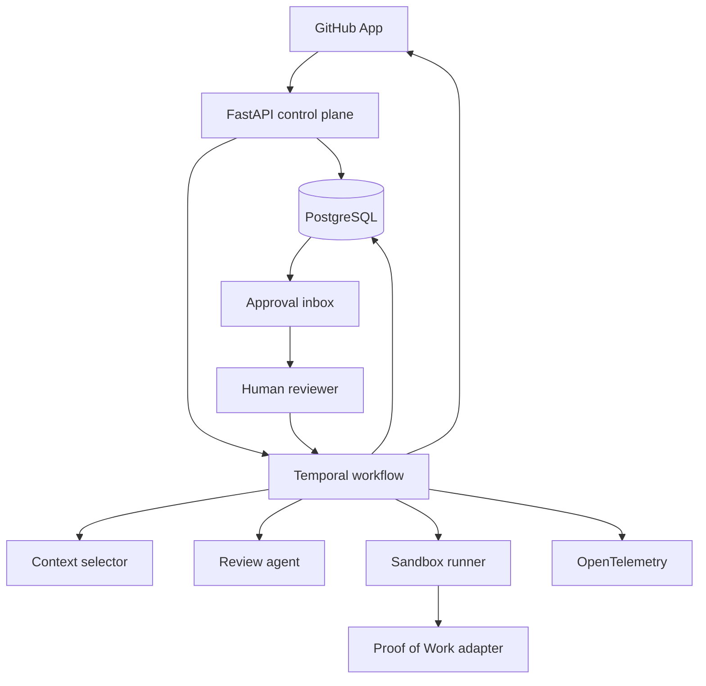

# Architecture

## Goal

Review a GitHub pull request with one agent, verify the result, and require human approval
before any output is published.

## Main components



## Ownership

- FastAPI owns authentication, webhook intake, API validation, and product records.
- Temporal owns run order, retries, cancellation, timeouts, and approval waits.
- Context selector owns file selection under a fixed token budget.
- Review agent owns structured proposed findings. It cannot publish them.
- Sandbox runner owns untrusted test execution.
- Proof of Work adapter owns the stable verification boundary.
- Web application owns review and approval screens.
- PostgreSQL owns product state and append-only audit events.

## Run boundary

One run is identified by repository, pull request number, and head SHA. A new head SHA creates
a new run and cancels the older active run. Findings never move between commits.

GitHub webhook intake verifies the HMAC SHA-256 signature over raw bytes before decoding JSON.
Only pull request opened, reopened, synchronize, and closed actions are accepted. Delivery IDs are
inserted in the same database transaction as repository, pull request, run, and command-event
records. A repeated owner and delivery ID returns success without creating another command.
The configured GitHub App installation is bound to one owner; validly signed events from other
installations are rejected before any database write. Command events store the complete versioned
`StartRunCommand`, never raw webhook payloads.
GitHub's pull request `updated_at` timestamp prevents older deliveries from regressing current
head or state. Reopening a pull request creates a new run generation even when its head SHA did
not change.
When opposite state events have the same source timestamp, open wins. This conservative rule can
cause an extra review but cannot let an ambiguous delayed close suppress a review.
Equal-time synchronize events use GitHub's required `before` and `after` SHA chain, including
out-of-order delivery, so a delayed predecessor cannot replace its known descendant.

## Message boundary

Messages use strict versioned JSON. A contract includes:

- `schema_version`
- `public_id`
- `owner_id`
- `run_id`
- `head_sha`
- event-specific payload

Unknown fields are rejected in version one. New optional fields require a minor contract
version. Breaking changes require a new major version and explicit migration.

Version-one contracts are defined in `packages/contracts/`. All contracts are immutable and
reject unknown fields. Run-bound messages carry `schema_version`, `public_id`, `owner_id`,
`run_id`, and `head_sha`. Webhook envelopes carry delivery, installation, repository, and pull
request identity before a run exists.

The run state machine is:

```text
queued -> selecting_context -> analyzing -> verifying -> awaiting_approval
                                                             |        |
                                                             v        v
                                                         published  rejected
```

Active states may also end as `failed` or `cancelled`. Terminal states cannot restart.

## Durable workflow boundary

One Temporal workflow ID is stable for an owner and pull request. Intake uses Temporal's atomic
signal-with-start operation: the first command starts the workflow, while a command for a new
head SHA signals the active execution. The old run records an explicit cancelled outcome and
continues as new with the replacement run, so two heads are never active in one workflow.
Webhook intake commits each command to the PostgreSQL outbox before returning. A production
dispatcher locks one pending command, sends its stable request ID to Temporal, then appends a
dispatch receipt. Before retrying, it rejects mismatched command identities and receipts commands
whose database generation is superseded or whose run is terminal. A superseded command that never
left the queue is cancelled with a terminal audit event in the same transaction. Active-run
retries use the same Temporal request, workflow generation, activity IDs, and provider idempotency
keys.
Database run generation travels in every start command. The workflow keeps only the highest
pending generation, so delayed signals cannot replace a newer commit or reopen generation.
Generation increases across every run for a pull request, including both new heads and reopens.
If an approved publish has already started, it settles before supersession; the old run records
the truthful publish outcome, then the replacement continues as new.

Context selection, analysis, verification, terminal recording, and publish are activities with
bounded timeouts, three retry attempts, stable activity IDs, and deterministic idempotency keys.
The production workflow worker polls workflow tasks from the configured queue. One provider
activity-worker deployment must register the complete activity set on that queue through the
`ActivityOperations` factory contract. The provider image may deploy or scale independently, but
partial activity sets must not compete on one queue. Missing activity workers fail within the
bounded schedule-to-start timeout instead of waiting forever.
Activity implementations must use those keys for database or provider writes. Human approval has
its own timeout. Human cancellation, rejection, timeout, and supersession are separate outcomes.
Activities heartbeat while running; cancellation waits for the current operation to stop before
recording a terminal outcome. Identity-valid early approvals wait until verification completes.
Temporal history stores identities and safe output references, not repository source, prompts,
model output, comment bodies, or secrets.
## Context boundary

Context selection is deterministic. Changed files are ordered first, followed by their direct
local Python imports. Repository paths are normalized and unsafe paths are rejected. Configured
generated or dependency directories are excluded. When the budget cannot hold a complete file,
the selector records a truncated prefix; remaining eligible files are recorded as excluded.
The selector accepts the model adapter's token counter so the final rendered context stays within
the configured model budget.

## Persistence boundary

PostgreSQL stores summaries and safe evidence references. It does not store repository source,
secrets, raw prompts, full agent output, or sandbox contents. Temporal history stores safe
workflow arguments only.

The first migration creates repositories, pull requests, runs, findings, approvals, external
actions, and append-only run events. Every product row has a public ULID and an `owner_id` ULID.
Relationships use bigint identity keys plus composite foreign keys that require child and parent
ownership to match. A pull request can have only one run for each head SHA. Finding keys,
approval decisions, external action targets, and event keys are unique within their retry
boundary. PostgreSQL rejects updates and deletes against the audit-event table.

Migrations run in filename order under a PostgreSQL advisory lock. Applied checksums are stored
in `schema_migrations`; changing an applied migration stops startup instead of silently changing
database history.

## Sandbox boundary

Pull request commands run only through `SandboxVerificationOperation` and the Docker sandbox
runner. Its trusted prepare and record callbacks may resolve inputs and persist bounded evidence;
they must never execute pull request commands. The worker copies the reviewed checkout into a
temporary source directory without `.git`, with byte, entry-count, and staging-time limits. It
mounts that copy read-only and copies it again inside the container to a size-limited tmpfs
workspace. The original checkout is never writable by pull request code. The container uses an
immutable image digest, no network, a read-only root filesystem, no Linux capabilities,
no-new-privileges, an unprivileged numeric
user, and hard CPU, memory, swap, process, workspace, temporary-file, output, and time limits.
Container logging is disabled so untrusted output cannot accumulate in the Docker daemon.

The worker invokes Docker with an argument vector, never a host shell. Timeout or output overflow
kills the container. Cancellation cannot interrupt cleanup; the worker confirms container absence
before accepting any result. Every path removes the container and temporary source copy; cleanup
failure blocks verification. A missing CLI, unreachable daemon, non-Linux engine, mutable image
reference, or invalid exit status also fails closed. Sandbox output is bounded evidence for the
verification adapter and must not be written to logs or long-term storage.
The production activity loader accepts only the fixed Docker CLI runner. Before staging or create,
the runner requires a Linux engine that reports memory, swap, CPU-quota, and PID-limit support.
Failed command evidence is recorded, then verification raises a typed non-retryable failure; a
failed sandbox command can never advance to approval.

## Write boundary

Every external write follows this order:

1. Build a proposed action.
2. Verify evidence.
3. Store proposed action.
4. Wait for human decision.
5. Publish with an idempotency key.
6. Store remote result.

No worker may bypass this path.

## Approval inbox boundary

The browser serves a public shell but receives no finding data until an API request presents the
reviewer bearer token. Server configuration binds that token to one owner and actor. Inbox queries
remain owner-scoped and show only current pull request heads in `awaiting_approval` state.

Each decision names one finding and repeats the shown head SHA. The API locks the finding and run,
checks the current pull request head and workflow state, then stores one immutable approval plus an
append-only audit event. Identical retries return the original receipt. Conflicting decisions or
stale commits fail. This endpoint never creates an external action or calls GitHub; publishing is a
later worker boundary.
