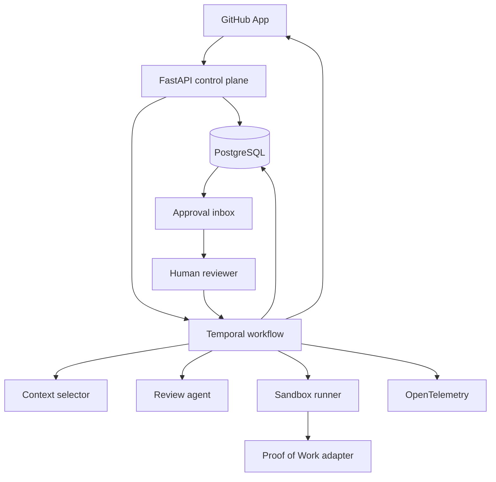

# Architecture

## Goal

Review a GitHub pull request with one agent, verify the result, and require human approval
before any output is published.

## Main components



## Ownership

- FastAPI owns authentication, webhook intake, API validation, and product records.
- Temporal owns run order, retries, cancellation, timeouts, and approval waits.
- Context selector owns file selection under a fixed token budget.
- Review agent owns structured proposed findings. It cannot publish them.
- Sandbox runner owns untrusted test execution.
- Proof of Work adapter owns the stable verification boundary.
- Web application owns review and approval screens.
- PostgreSQL owns product state and append-only audit events.

## Run boundary

One run is identified by repository, pull request number, and head SHA. A new head SHA creates
a new run and cancels the older active run. Findings never move between commits.

## Message boundary

Messages use strict versioned JSON. A contract includes:

- `schema_version`
- `public_id`
- `owner_id`
- `run_id`
- `head_sha`
- event-specific payload

Unknown fields are rejected in version one. New optional fields require a minor contract
version. Breaking changes require a new major version and explicit migration.

Version-one contracts are defined in `packages/contracts/`. All contracts are immutable and
reject unknown fields. Run-bound messages carry `schema_version`, `public_id`, `owner_id`,
`run_id`, and `head_sha`. Webhook envelopes carry delivery, installation, repository, and pull
request identity before a run exists.

The run state machine is:

```text
queued -> selecting_context -> analyzing -> verifying -> awaiting_approval
                                                             |        |
                                                             v        v
                                                         published  rejected
```

Active states may also end as `failed` or `cancelled`. Terminal states cannot restart.

## Persistence boundary

PostgreSQL stores summaries and safe evidence references. It does not store repository source,
secrets, raw prompts, full agent output, or sandbox contents. Temporal history stores safe
workflow arguments only.

## Write boundary

Every external write follows this order:

1. Build a proposed action.
2. Verify evidence.
3. Store proposed action.
4. Wait for human decision.
5. Publish with an idempotency key.
6. Store remote result.

No worker may bypass this path.
